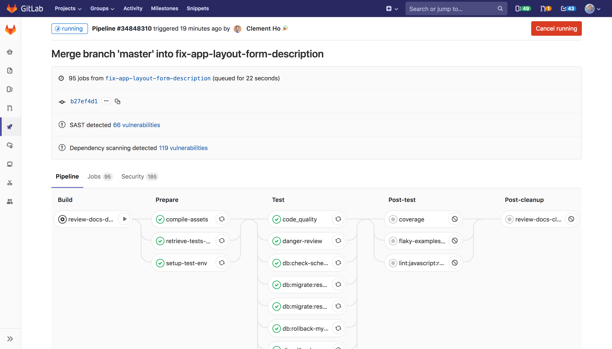

---

marp: true
paginate: true
# theme: uncover
# theme: gaia
# theme: fullops
size: 16:9
# size: 4:3
class: invert

style: |
  img[alt~="center"] {
    display: block;
    margin: 0 auto;
  }
  img[alt~="right"] {
    align: right;
    //display: block;
    margin: 0 auto;
  }


---

# **Optimisez l'efficacité et les coûts de votre CI GitLab sur AKS**


---

## **Pierre Bruneval**
<!-- backgroundcolor: black -->


---
<!-- backgroundcolor: black -->


## **Contexte**

Petit éditeur logiciel
Appli mobile  + infra micro-services

* Azure Kubernetes Service
* Petite infra
* Gitlab CI

---


---
<!-- backgroundcolor: black -->


## **Infra**

Condensée pour contenir les coûts :

* Cluster de prod
* Cluster de préprod
* Cluster QA, staging, ...

--> Mutualisation QA/staging et Gitlab

---


## **Problématique**

**Comment contenir les coûts de la CI sans restreindre la performance ?**

---


## **Analyse**

Quelle ressources de compute ?

Critères :

* flexibilité
* prix

---


## **Options**

* Pay-as-you-go
* Reserved
* Bare metal
* ...

---


## **Instances spot**

90 % moins cher que pay-as-you-go

Flexible

Inconvénient : preemption

Scheduling ciblé grâce aux taints et tolerations

---


## **Mise en oeuvre 1/2**

* Création d'un node pool spot
* Config des taints

---


## **Mise en oeuvre 2/2**

* Configuration du runner Gitlab

```yaml
runners:
config: "[[runners]]\n  clone_url = \"https://gitlab.fullops.com/\\"\n  environment
= [\"DOCKER_HOST=tcp://docker:2376\", \"DOCKER_TLS_CERTDIR=/certs\", \"DOCKER_TLS_VERIFY=1\",
\"DOCKER_CERT_PATH=/certs/client\"]\n [runners.kubernetes]\n    namespace = \"{{.Release.Namespace}}\" \n    image
= \"ubuntu:20.04\"\n    privileged = true\n    poll_timeout = 600\n    cpu_request
= \"8\"\n    cpu_limit = \"14\"\n    memory_request = \"16Gi\"\n    memory_limit
= \"30Gi\"\n    [runners.kubernetes.node_tolerations]\n      \"kubernetes.azure.com/scalesetpriority=spot\"
= \"NoSchedule\"\n    [[runners.kubernetes.volumes.empty_dir]]\n      name = \"docker-certs\"\n
\     mount_path = \"/certs/client\"\n      medium = \"Memory\"\n    [runners.cache]\n
\     Type = \"azure\"\n      [runners.cache.azure]\n        AccountName = \"k8s-gitlabrunner_cache\"\n
\       AccountKey = \"XXXABCD1234==\"\n
\       ContainerName = \"runnercache-container\"\n        StorageDomain = \"blob.core.windows.net\"\n
\     Insecure = false\n"
executor: kubernetes
name: runner_fullOps_tls
tags: azure, docker
```

* Gestion des events d’interruption au niveau des jobs Gitlab CI

---


## Pour aller plus loin

Plusieurs runners Gitlab avec des specs variées
--> Adéquation avec les jobs

Node pools associés aux runners

---


## Questions
